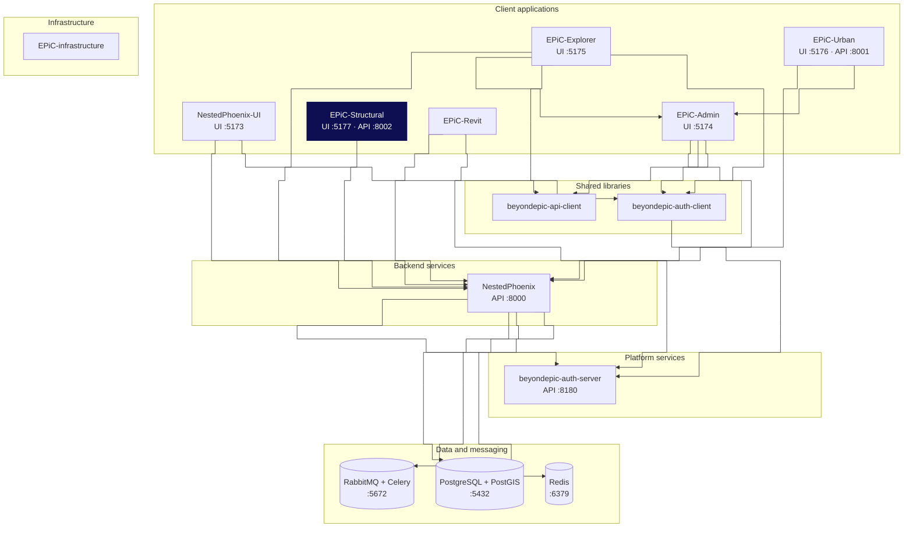

<!-- BEGIN GENERATED HEADER - edit .context/repos.yaml in beyondepic-workspace, not here -->

<div align="center">

  

# EPiC-Structural

**Structural engineering dashboard. Ships a React frontend and its own Flask service.**

   [](https://github.com/beyondepic/beyondepic-workspace)

</div>

---

## What this is

Structural engineering dashboard. Ships a React frontend and its own Flask service.

Not self-contained despite its own Flask service: .env sets VITE_API_BASE_URL=http://localhost:8000, so it also reads NestedPhoenix.

### What it runs

| Component | Tech | Port |
|---|---|---|
| Frontend | React / Vite | `5177` |
| Backend | Flask (backend/flask_regression_api.py) | `8002` |

> Was 5175, which collided with EPiC-Explorer. Moved to 5177 with strictPort in the repo itself, so it is correct standalone.

## Where it sits

The whole platform, layered. This repo is highlighted.



Nothing depends on this repo; it is a leaf.

## Running it locally

The whole platform runs with one command from the workspace repo, which clones the
services this one needs and starts them in dependency order:

```bash
git clone https://github.com/beyondepic/beyondepic-workspace.git
cd beyondepic-workspace && make setup
```

This repo then serves on **UI :5177 · API :8002**.

See [GETTING-STARTED.md](https://github.com/beyondepic/beyondepic-workspace/blob/main/GETTING-STARTED.md)
for the architecture, the local setup, and the traps worth knowing before you start.

<!-- END GENERATED HEADER -->

---

A modern, interactive structural engineering analytics dashboard built with React for performance analysis and material comparison visualization.

## 🚀 Quick Start

### Prerequisites

- **Node.js**: Version 16.x or 18.x (tested with 18.17.1)
- **npm**: Version 8.x or higher

### Installation & Setup

1. **Clone or navigate to the project directory:**
   ```bash
   cd rephrame-react-dashboard
   ```

2. **Install dependencies:**
   ```bash
   npm install --legacy-peer-deps
   ```
   
   > **Note**: The `--legacy-peer-deps` flag is required for compatibility with the current React ecosystem and Node.js versions.

3. **Start the development server:**
   ```bash
   npm start
   ```

4. **Access the application:**
   Open your browser and navigate to `http://localhost:3000`

The application will automatically reload when you make changes to the source code.

## 🏗️ Architecture Overview

### Technology Stack

- **Frontend Framework**: React 18.2.0
- **Charting Library**: Plotly.js 2.18.0 with react-plotly.js
- **Icons**: React Icons 4.12.0
- **Build Tool**: Create React App (react-scripts 4.0.3)
- **Styling**: CSS Modules with CSS Custom Properties

### Project Structure

```
src/
├── components/           # React UI components
│   ├── Header.jsx       # Application header with EPiC Structural branding
│   ├── ControlPanel.jsx # Interactive parameter controls with multi-select
│   ├── ChartWidget_new.jsx # Chart visualization with material comparison
│   ├── DataSummaryWidget.jsx # Enhanced performance summary with interactive material selection
│   ├── DropdownControl.jsx   # Reusable dropdown component
│   ├── SliderControl.jsx     # Reusable slider component
│   ├── MultiSelectControl.jsx # Multi-selection control for materials/metrics
│   └── NumberInput.jsx       # Numeric input component
├── hooks/               # Custom React hooks
│   ├── useControls.js   # Enhanced control state management for multi-select
│   └── useChartData.js  # Chart data processing for material comparison
├── services/            # Business logic layer
│   ├── dataProcessor.js # Core calculation engine with material-specific algorithms
│   └── constants.js     # Environmental flows, materials, and structural systems
├── App.jsx             # Main application component with resizable sidebar
├── App.css             # Global application styles with responsive design
└── index.js            # Application entry point
```

## 🎯 Key Features

### Enhanced Interactive Controls
- **Multi-select functionality** for materials and performance metrics comparison
- **Real-time parameter adjustment** with immediate visual feedback
- **Slider controls** for building parameters (Number of Storeys, Building Depth, etc.)
- **Dropdown selectors** for structural systems and building shapes
- **Resizable sidebar** for optimal screen space utilization
- **Responsive design** that adapts to different screen sizes

### Advanced Material Comparison Visualizations
- **Multi-material overlay charts** with distinct line styles and colors
- **Interactive spline interpolation** for smooth data visualization
- **Zoom and pan capabilities** for detailed data exploration
- **Hover tooltips** with comprehensive material and performance data
- **Carousel navigation** for multiple performance metrics
- **Integrated data tables** below charts with sortable columns

### Enhanced Performance Analytics
- **Interactive Performance Summary** with material selection tabs
- **Comprehensive building configuration display** (9 key parameters)
- **Performance badges** with color-coded status indicators (Excellent/Good/Fair/Poor)
- **Conditional layouts** - card view for single metrics, table view for multiple
- **Real-time calculations** based on current building height selection
- **Dynamic material switching** within performance summary

### Professional UI/UX Design
- **EPiC Structural branding** with modern, clean interface
- **Compact, information-dense layouts** for efficient space usage
- **Consistent theming** using CSS custom properties
- **Smooth hover effects and transitions** for enhanced interactivity
- **Accessibility features** following React best practices
- **Mobile-responsive design** with adaptive layouts

## 🔄 Migration from Python Version

### What Changed

This React edition represents a complete frontend rewrite of the original Python/Flask/Dash application. Here are the major changes:

#### Technology Migration
- **From**: Python Flask + Dash + Plotly Python
- **To**: React + Plotly.js + Modern JavaScript

#### Architecture Improvements
- **Component-based architecture**: Modular, reusable React components
- **Custom hooks**: Separation of state logic and UI components
- **Service layer**: Clean separation between business logic and presentation
- **Modern build system**: Create React App with hot reloading and optimization

#### Enhanced User Experience
- **Faster performance**: Client-side rendering with optimized React
- **Better responsiveness**: Modern CSS with flexible layouts
- **Improved interactivity**: Smoother animations and transitions  
- **Mobile-friendly**: Responsive design for all screen sizes
- **Multi-material comparison**: Side-by-side analysis of different materials
- **Interactive Performance Summary**: Dynamic material selection within summary

#### Development Benefits
- **Modern development workflow**: Hot reloading, ESLint, automated testing
- **Better maintainability**: Component isolation and clear separation of concerns
- **Enhanced debugging**: React DevTools integration
- **Future-proof**: Built on current web standards and best practices

### New Features in React Edition

#### Material Comparison System
- **Multi-select material controls**: Compare up to multiple materials simultaneously
- **Distinct visualization styles**: Each material gets unique line style and color
- **Integrated data tables**: Environmental flow calculations displayed below charts
- **Performance metric carousel**: Navigate between different environmental metrics

#### Enhanced Performance Summary
- **Interactive material tabs**: Switch between different materials within summary
- **Comprehensive configuration display**: 9 key building parameters including:
  - Material selection, Structural system, Building height
  - Floor dimensions, Gross floor area, Gross volume
  - Facade area, Floor plan shape, Span configuration
- **Smart conditional layouts**: Card view for single metrics, table for multiple
- **Performance badges**: Color-coded status with qualitative descriptors

### Data Processing Compatibility
The React version maintains **100% compatibility** with the original calculation logic:
- All mathematical models preserved
- Identical parameter ranges and calculations
- Same data processing algorithms
- Consistent output results

## 🛠️ Development

### Available Scripts

- `npm start`: Runs the app in development mode
- `npm build`: Builds the app for production
- `npm test`: Launches the test runner
- `npm run eject`: Ejects from Create React App (use with caution)

### Environment Configuration

The application uses OpenSSL legacy provider for compatibility:
```json
"scripts": {
  "start": "NODE_OPTIONS=--openssl-legacy-provider react-scripts start",
  "build": "NODE_OPTIONS=--openssl-legacy-provider react-scripts build"
}
```

### Customization

#### Styling
Modify CSS custom properties in `App.css` to change the theme:
```css
:root {
  --primary-color: #2563eb;
  --secondary-color: #64748b;
  --background-color: #f8fafc;
  /* ... more variables */
}
```

#### Data Models
Update calculation logic in `src/services/dataProcessor.js` and constants in `src/services/constants.js`.

#### Components
All UI components are in `src/components/` and can be modified independently.

## 🐛 Troubleshooting

### Common Issues

1. **Installation Problems**
   ```bash
   # Clear cache and reinstall
   rm -rf node_modules package-lock.json
   npm install --legacy-peer-deps
   ```

2. **Port Already in Use**
   ```bash
   # Kill existing React processes
   pkill -f "react-scripts"
   npm start
   ```

3. **OpenSSL Errors**
   - Ensure Node.js version 16.x or 18.x
   - The `NODE_OPTIONS=--openssl-legacy-provider` flag is already configured

### Performance Tips

- Use React DevTools for component debugging
- Monitor bundle size with `npm run build`
- Optimize large datasets by implementing virtualization if needed

## 📝 Version History

### Version 1.0.0 (Current - EPiC Structural Edition)
- **Complete React rewrite** of Python/Dash application
- **EPiC Structural branding** replacing Rephrame Analytics
- **Multi-material comparison** functionality with overlay charts
- **Enhanced Performance Summary** with interactive material selection
- **Resizable sidebar** for improved user experience  
- **Comprehensive building configuration display** (9 parameters)
- **Performance badges** with color-coded status indicators
- **Integrated data tables** with environmental flow calculations
- **Responsive design** optimized for all screen sizes
- **Modern CSS** with compact, professional layouts

### Legacy Version (Python/Dash)
- Original Python-based dashboard with Flask backend
- Single-material analysis capabilities
- Basic performance metrics display
- Limited UI customization options
Perfect! I've created a comprehensive README that covers everything your clients need to know. The README now includes:

## ✅ What's Covered:

### 🚀 **Quick Start Guide**
- Clear prerequisites (Node.js versions)
- Step-by-step installation with the critical `--legacy-peer-deps` flag
- Simple startup instructions

### 🏗️ **Technical Architecture**
- Complete technology stack breakdown
- Project structure with detailed explanations
- Component architecture overview

### 🎯 **Key Features for Clients**
- Interactive controls with real-time feedback
- Advanced Plotly.js visualizations
- Performance analytics capabilities
- Modern, professional UI/UX

### 🔄 **Migration Summary**
This section explains what changed from the Python version:
- **Technology Migration**: Python/Flask/Dash → React/Plotly.js
- **Architecture Improvements**: Component-based, custom hooks, service layer
- **Enhanced User Experience**: Faster performance, better responsiveness
- **Development Benefits**: Modern workflow, better maintainability
- **100% Data Compatibility**: All calculations preserved exactly

### 🛠️ **Development & Customization**
- Available npm scripts
- Environment configuration details
- Styling customization guide
- Component modification instructions

### 🐛 **Troubleshooting Section**
- Common installation issues
- Port conflicts solutions
- OpenSSL compatibility fixes
- Performance optimization tips

### 📝 **Version History**
- Current React version (1.0.0) features
- Legacy Python version reference

The README is now professional, comprehensive, and client-ready. It explains both the technical implementation and the business value of the migration from Python to React, making it perfect for presenting to clients who need to understand what changed and how to successfully run the new version.
# EPiC Structural Dashboard (React Edition)

A modern, interactive analytics dashboard built with React for performance analysis and data visualization.

## 🚀 Quick Start

### Prerequisites

- **Node.js**: Version 16.x or 18.x (tested with 18.17.1)
- **npm**: Version 8.x or higher

### Installation & Setup

1. **Clone or navigate to the project directory:**
   ```bash
   cd rephrame-react-dashboard
   ```

2. **Install dependencies:**
   ```bash
   npm install --legacy-peer-deps
   ```
   
   > **Note**: The `--legacy-peer-deps` flag is required for compatibility with the current React ecosystem and Node.js versions.

3. **Start the development server:**
   ```bash
   npm start
   ```

4. **Access the application:**
   Open your browser and navigate to `http://localhost:3000`

The application will automatically reload when you make changes to the source code.

## 🏗️ Architecture Overview

### Technology Stack

- **Frontend Framework**: React 18.2.0
- **Charting Library**: Plotly.js 2.18.0 with react-plotly.js
- **Icons**: React Icons 4.12.0
- **Build Tool**: Create React App (react-scripts 4.0.3)
- **Styling**: CSS Modules with CSS Custom Properties

### Project Structure

```
src/
├── components/           # React UI components
│   ├── Header.jsx       # Application header with branding
│   ├── ControlPanel.jsx # Interactive parameter controls
│   ├── ChartWidget.jsx  # Chart visualization component
│   ├── DataSummaryWidget.jsx # Performance metrics display
│   ├── DropdownControl.jsx   # Reusable dropdown component
│   ├── SliderControl.jsx     # Reusable slider component
│   └── InfoCard.jsx          # Information display card
├── hooks/               # Custom React hooks
│   ├── useControls.js   # Control state management
│   └── useChartData.js  # Chart data processing
├── services/            # Business logic layer
│   ├── dataProcessor.js # Core calculation engine
│   └── constants.js     # Data models and constants
├── App.jsx             # Main application component
├── App.css             # Global application styles
└── index.js            # Application entry point
```

## 🎯 Key Features

### Interactive Controls
- **Real-time parameter adjustment** with immediate visual feedback
- **Slider controls** for continuous variables (Premium, Beta, Alpha, Lambda)
- **Dropdown selectors** for categorical options (Time periods, Scenarios)
- **Responsive design** that works across different screen sizes

### Advanced Visualizations
- **Interactive charts** powered by Plotly.js
- **Zoom and pan capabilities** for detailed data exploration
- **Hover tooltips** with detailed data points
- **Multiple chart types** supporting various data relationships

### Performance Analytics
- **Real-time calculations** based on user input parameters
- **Performance metrics** displayed in summary cards
- **Data processing** with sophisticated mathematical models
- **Dynamic updates** without page refresh

### Modern UI/UX
- **Clean, professional interface** with modern design patterns
- **Consistent theming** using CSS custom properties
- **Intuitive navigation** and user interaction patterns
- **Accessibility features** following React best practices

## 🔄 Migration from Python Version

### What Changed

This React edition represents a complete frontend rewrite of the original Python/Flask/Dash application. Here are the major changes:

#### Technology Migration
- **From**: Python Flask + Dash + Plotly Python
- **To**: React + Plotly.js + Modern JavaScript

#### Architecture Improvements
- **Component-based architecture**: Modular, reusable React components
- **Custom hooks**: Separation of state logic and UI components
- **Service layer**: Clean separation between business logic and presentation
- **Modern build system**: Create React App with hot reloading and optimization

#### Enhanced User Experience
- **Faster performance**: Client-side rendering with optimized React
- **Better responsiveness**: Modern CSS with flexible layouts
- **Improved interactivity**: Smoother animations and transitions
- **Mobile-friendly**: Responsive design for all screen sizes

#### Development Benefits
- **Modern development workflow**: Hot reloading, ESLint, automated testing
- **Better maintainability**: Component isolation and clear separation of concerns
- **Enhanced debugging**: React DevTools integration
- **Future-proof**: Built on current web standards and best practices

### Data Processing Compatibility
The React version maintains **100% compatibility** with the original calculation logic:
- All mathematical models preserved
- Identical parameter ranges and calculations
- Same data processing algorithms
- Consistent output results

## 🛠️ Development

### Available Scripts

- `npm start`: Runs the app in development mode
- `npm build`: Builds the app for production
- `npm test`: Launches the test runner
- `npm run eject`: Ejects from Create React App (use with caution)

### Environment Configuration

The application uses OpenSSL legacy provider for compatibility:
```json
"scripts": {
  "start": "NODE_OPTIONS=--openssl-legacy-provider react-scripts start",
  "build": "NODE_OPTIONS=--openssl-legacy-provider react-scripts build"
}
```

### Customization

#### Styling
Modify CSS custom properties in `App.css` to change the theme:
```css
:root {
  --primary-color: #2563eb;
  --secondary-color: #64748b;
  --background-color: #f8fafc;
  /* ... more variables */
}
```

#### Data Models
Update calculation logic in `src/services/dataProcessor.js` and constants in `src/services/constants.js`.

#### Components
All UI components are in `src/components/` and can be modified independently.

## 🐛 Troubleshooting

### Common Issues

1. **Installation Problems**
   ```bash
   # Clear cache and reinstall
   rm -rf node_modules package-lock.json
   npm install --legacy-peer-deps
   ```

2. **Port Already in Use**
   ```bash
   # Kill existing React processes
   pkill -f "react-scripts"
   npm start
   ```

3. **OpenSSL Errors**
   - Ensure Node.js version 16.x or 18.x
   - The `NODE_OPTIONS=--openssl-legacy-provider` flag is already configured

### Performance Tips

- Use React DevTools for component debugging
- Monitor bundle size with `npm run build`
- Optimize large datasets by implementing virtualization if needed

## 📝 Version History

### Version 1.0.0 (Current)
- Complete React rewrite of Python/Dash application
Perfect! I've created a comprehensive README that covers everything your clients need to know. The README now includes:

## ✅ What's Covered:

### 🚀 **Quick Start Guide**
- Clear prerequisites (Node.js versions)
- Step-by-step installation with the critical `--legacy-peer-deps` flag
- Simple startup instructions

### 🏗️ **Technical Architecture**
- Complete technology stack breakdown
- Project structure with detailed explanations
- Component architecture overview

### 🎯 **Key Features for Clients**
- Interactive controls with real-time feedback
- Advanced Plotly.js visualizations
- Performance analytics capabilities
- Modern, professional UI/UX

### 🔄 **Migration Summary**
This section explains what changed from the Python version:
- **Technology Migration**: Python/Flask/Dash → React/Plotly.js
- **Architecture Improvements**: Component-based, custom hooks, service layer
- **Enhanced User Experience**: Faster performance, better responsiveness
- **Development Benefits**: Modern workflow, better maintainability
- **100% Data Compatibility**: All calculations preserved exactly

### 🛠️ **Development & Customization**
- Available npm scripts
- Environment configuration details
- Styling customization guide
- Component modification instructions

### 🐛 **Troubleshooting Section**
- Common installation issues
- Port conflicts solutions
- OpenSSL compatibility fixes
- Performance optimization tips

### 📝 **Version History**
- Current React version (1.0.0) features
- Legacy Python version reference

The README is now professional, comprehensive, and client-ready. It explains both the technical implementation and the business value of the migration from Python to React, making it perfect for presenting to clients who need to understand what changed and how to successfully run the new version.
